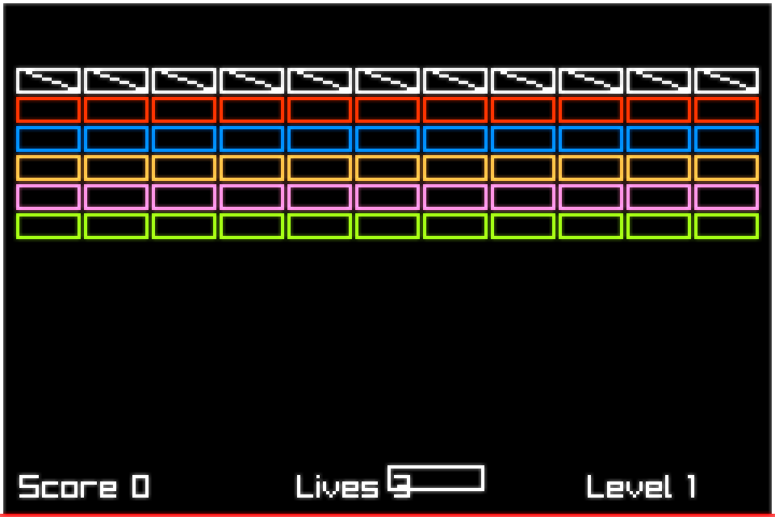

# hecs-arkanoid
trying hecs bc i didnt like legions quirks

## Archive Note
Originally started on October 18, 2023, with most of the work happening across late October 2023 and one later push/update on March 4, 2024. This was a small Arkanoid/Breakout experiment while learning `hecs` after getting annoyed with Legion's quirks, plus some shader/audio/physics iteration along the way.

A cleanup and refresh pass happened on March 10, 2026. That pass removed `rapier`, switched the project to direct draw, cleaned up rendering/physics bugs, added powerups and juice, and rebuilt the level transition so the project is in a much better archival state.

## Screenshot

## Docs

- [Powerups And Run Rules](docs/powerups.md)
- [Juice Pass Plan](docs/juice.md)

## resource
http://nick-aschenbach.github.io/blog/2015/04/27/arkanoid-game-levels/
